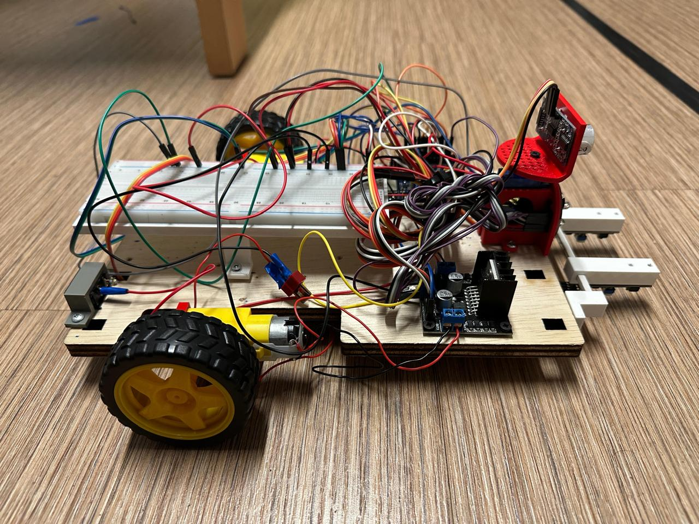
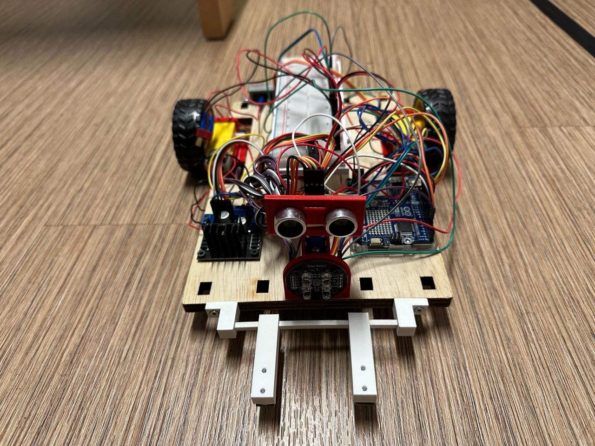

# Autonomous Line-Following Car




An intelligent line-following vehicle capable of obstacle detection and autonomous navigation with dynamic decision-making capabilities.

## Table of Contents
- [Overview](#overview)
- [Features](#features)
- [System Architecture](#system-architecture)
- [Components](#components)
- [Installation & Setup](#installation--setup)
- [Usage](#usage)
- [Code Structure](#code-structure)
- [System Design](#system-design)
- [Results](#results)
- [Future Enhancements](#future-enhancements)
- [Contributors](#contributors)
- [Acknowledgments](#acknowledgments)

## Overview

This project presents the design and development of an autonomous line-following vehicle that combines traditional path-following methods with real-time obstacle detection and intelligent decision-making. The vehicle uses multiple sensors for environmental awareness and can navigate complex tracks while avoiding obstacles.

**Note: The final working version is available in the `main` branch.**

## Features

- **Line Following**: Precise tracking of black lines on white surfaces using dual IR sensors
- **Obstacle Detection**: Real-time distance measurement using HC-SR04 ultrasonic sensor
- **Intelligent Navigation**: Dynamic obstacle avoidance with path recalculation
- **Adaptive Reorientation**: 360-degree environmental scanning using servo-mounted ultrasonic sensor
- **Modular Design**: Easy-to-maintain hardware and software architecture
- **Differential Drive System**: Tight turning radius for precise navigation

## System Architecture

The system is built around five main subsystems:

1. **Power System**: 12V 3200mAh LiPo battery for reliable power supply
2. **Controller Unit**: Arduino Uno (ATmega328P) for central processing
3. **Sensor System**: IR sensors, ultrasonic sensor, and servo motor for environmental awareness
4. **Motor System**: Dual DC motors with L298N driver for movement control
5. **Chassis**: Custom-designed 3D printed components for secure mounting

## Components

### Hardware
- **Arduino Uno**: ATmega328P microcontroller with 14 digital GPIO pins
- **LiPo Battery**: 12V 3200mAh 20C for power supply
- **DC Motors**: 2x 9V DC motors for rear wheel drive
- **L298N Motor Driver**: Motor control and power distribution
- **HC-SR04 Ultrasonic Sensor**: Distance measurement (2cm - 3m range)
- **ST1140 IR Sensors**: 2x infrared sensors for line detection
- **Servo Motor**: For ultrasonic sensor positioning and scanning

### 3D Printed Parts
- Battery holder with cable management
- IR sensor mounts with optimized angles
- Motor holders with secure fastening
- Servo mount for sensor positioning

## Installation & Setup

### Prerequisites
- Arduino IDE installed
- Basic understanding of Arduino programming
- 3D printer access for chassis components

### Hardware Assembly
1. Mount the 3D printed chassis components
2. Install motors in their holders and attach to chassis
3. Mount IR sensors at the base with proper downward angle
4. Connect ultrasonic sensor to servo motor
5. Wire all components according to the pin definitions in the code

### Software Installation
1. Clone this repository:
   ```bash
   git clone https://github.com/Muhammad-Hamas-git/Prototyping-Autonomous-Car.git
   cd autonomous-line-following-car
   ```

2. Open the Arduino IDE and load the main sketch from the `main` branch

3. Install required libraries:
   - Servo library (usually pre-installed)

4. Upload the code to your Arduino Uno

## Usage

### Basic Operation
1. Power on the vehicle
2. Place it on a track with a black line on white surface
3. The vehicle will automatically:
   - Follow the line using differential drive system
   - Detect obstacles within 15cm threshold
   - Execute obstacle avoidance maneuvers
   - Reorient itself to continue following the line

### Adjustable Parameters
Modify these values in the code to tune performance:

```cpp
int motorSpeed = 65;           // Base speed for forward movement
float backwardsScale = 1.0;    // Scaling factor for backward turns
int angleSnapSpeed = 75;       // Speed for 90-degree turns
int obstacleThreshold = 15;    // Obstacle detection distance (cm)
```

### Key Functions
- `setup()`: Hardware initialization
- `loop()`: Main control loop with obstacle detection and line following
- `avoidObstacle()`: Pre-programmed obstacle avoidance sequence
- `reorientAfterAvoidance()`: Adaptive reorientation using environmental scanning
- `measureDistance()`: Ultrasonic distance measurement
- Motor control functions for precise movement

## System Design

The project follows a systematic approach using SysML (Systems Modeling Language) for:

- **Requirements Analysis**: Comprehensive functional requirements definition
- **State Machine Modeling**: System behavior and state transitions
- **Activity Diagrams**: Decision-making and navigation logic
- **Component Architecture**: Modular system design

### Navigation Logic
1. **Line Following**: Dual IR sensors provide feedback for differential steering
2. **Obstacle Detection**: Continuous distance monitoring with 15cm threshold
3. **Avoidance Sequence**: Pre-programmed maneuvers to navigate around obstacles
4. **Reorientation**: 360-degree scanning to find optimal path back to line

## Results

The prototype successfully demonstrates:
- ✅ Accurate line following on various track configurations
- ✅ Reliable obstacle detection and avoidance
- ✅ Adaptive reorientation capabilities
- ✅ Stable operation in dynamic environments

### Performance Characteristics
- **Detection Range**: 2-300cm (ultrasonic sensor)
- **Obstacle Threshold**: 15cm (adjustable)
- **Turn Precision**: Approximate 90-degree turns
- **Power Consumption**: Optimized for extended operation

## Future Enhancements

Planned improvements for next iterations:

1. **Enhanced Mobility**: Add two front DC motors for improved maneuverability
2. **360° Sensing**: Rear-mounted ultrasonic sensor for comprehensive awareness
3. **Advanced Processing**: Upgrade to microcontroller with more I/O pins
4. **Color Recognition**: Integration of color sensors for obstacle-specific responses
5. **Improved Stability**: Enhanced chassis design for better balance

## 👥 Contributors

- **Mir Sharjil Hasan** - Electronic Engineering, Hamm-Lippstadt University
- **Talha Khan** - Electronic Engineering, Hamm-Lippstadt University  
- **Muhammad Hamas** - Electronic Engineering, Hamm-Lippstadt University

*All team members contributed equally to the design, development, and successful completion of this project.*

## Acknowledgments

Special thanks to:
- **Prof. Dr. S. Henkler** and **Prof. G. Wahrmann** for their guidance and feedback
- **Hamm-Lippstadt University of Applied Sciences** for providing resources and support
- The open-source Arduino community for libraries and documentation

## 📄 License

This project is open source and available under the [MIT License](LICENSE).

## Contact

For questions or collaboration opportunities, please reach out to the contributors through their university emails or create an issue in this repository.

---

*Project completed in June 2025 as part of the Electronic Engineering program at Hamm-Lippstadt University of Applied Sciences.*
